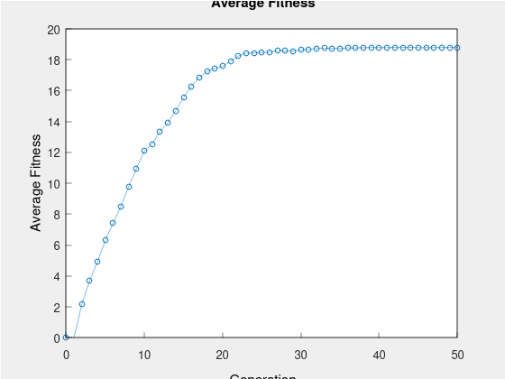

# Genetic Scheduling

### Summary

This program uses a genetic algorithm to generate a space utilization schedule for a client agency's activities. The schedule needs to determine the time slot, room, and facilitator for each activity. Each activity has a list of preferred and other facilitators, and the expected enrollment for each activity should be in a room big enough to hold it. The initial assignment is random, and the program will generate a population of random possible schedules and apply a genetic algorithm to improve it.

### Fitness Function
- For each activity, fitness starts at 0.
- Activity is scheduled at the same time in the same room as another of the activities: -0.5
- Room size:
    - Activities is in a room too small for its expected enrollment: -0.5
    - Activities is in a room with capacity > 3 times expected enrollment: -0.2
    - Activities is in a room with capacity > 6 times expected enrollment: -0.4
    - Otherwise + 0.3
- Activities is overseen by a preferred facilitator: + 0.5
- Activities is overseen by another facilitator listed for that activity: +0.2
- Activities is overseen by some other facilitator: -0.1
- Facilitator load:
    - Activity facilitator is scheduled for only 1 activity in this time slot: + 0.2
    - Activity facilitator is scheduled for more than one activity at the same time: - 0.2
    - Facilitator is scheduled to oversee more than 4 activities total: -0.5
    - Facilitator is scheduled to oversee 1 or 2 activities*: -0.4
        - Exception: Dr. Tyler is committee chair and has other demands on his time. *No penalty if he’s only required to oversee < 2 activities.
    - If any facilitator scheduled for consecutive time slots: Same rules as for SLA 191 and SLA101 in consecutive time slots—see below.
- The 2 sections of SLA 101 are more than 4 hours apart: + 0.5
- Both sections of SLA 101 are in the same time slot: -0.5
- The 2 sections of SLA 191 are more than 4 hours apart: + 0.5
- Both sections of SLA 191 are in the same time slot: -0.5
- A section of SLA 191 and a section of SLA 101 are overseen in consecutive time slots (e.g., 10AM & 11 AM): +0.5
    - In this case only (consecutive time slots), one of the activities is in Roman or Beach,
and the other isn’t: -0.4
        - It’s fine if neither is in one of those buildings, of activity; we just want to avoid having
consecutive activities being widely separated.
- A section of SLA 191 and a section of SLA 101 are taught separated by 1 hour (e.g., 10
AM & 12:00 Noon): + 0.25
- A section of SLA 191 and a section of SLA 101 are taught in the same time slot: -0.25

### Setup

1. Clone the repository

To clone the repository and its submodules, open a terminal and run the following command:

`git clone --recurse-submodules https://github.com/jonathanbenson/genetic-scheduling`

2. Build the Project

To build the project, you need a C++17 compiler. Make sure that the compiler is installed on your system and available in your PATH.

Open a terminal and navigate to the root directory of the cloned repository. Then, run the following commands:

```
mkdir build
cd build
cmake ..
make
```

The above commands create a build directory, run CMake to generate the makefiles, and then run make to build the project.

3. Test the Project

To test the project, navigate to the build directory and run the executable:

```
cd build
./test
```

4. Run the Project

To run the project in the build directory, run the executable:

```
./main
```

### Example Program
```
Genetic Scheduling Program

Population size: 500
# Generations: 50
Sample Size for Tournament Selection: 10
Initial Mutation Rate: 0.01
Mutation Rate Half-Life: 5

Evolving schedules...

Generation: 1, Avg. Fitness: 2.9038
Generation: 2, Avg. Fitness: 5.2128
Generation: 3, Avg. Fitness: 7.1234
Generation: 4, Avg. Fitness: 8.5704
Generation: 5, Avg. Fitness: 9.6628
Generation: 6, Avg. Fitness: 10.7124
Generation: 7, Avg. Fitness: 11.7128
Generation: 8, Avg. Fitness: 12.8638
Generation: 9, Avg. Fitness: 13.894
Generation: 10, Avg. Fitness: 15.0376
Generation: 11, Avg. Fitness: 15.7056
Generation: 12, Avg. Fitness: 16.283
Generation: 13, Avg. Fitness: 16.8144
Generation: 14, Avg. Fitness: 17.4146
Generation: 15, Avg. Fitness: 17.9742
Generation: 16, Avg. Fitness: 18.2578
Generation: 17, Avg. Fitness: 18.4286
Generation: 18, Avg. Fitness: 18.5452
Generation: 19, Avg. Fitness: 18.6056
Generation: 20, Avg. Fitness: 18.6888
Generation: 21, Avg. Fitness: 18.7556
Generation: 22, Avg. Fitness: 18.8196
Generation: 23, Avg. Fitness: 18.89
Generation: 24, Avg. Fitness: 18.92
Generation: 25, Avg. Fitness: 18.9188
Generation: 26, Avg. Fitness: 18.9356
Generation: 27, Avg. Fitness: 18.9476
Generation: 28, Avg. Fitness: 18.942
Generation: 29, Avg. Fitness: 18.9636
Generation: 30, Avg. Fitness: 18.958
Generation: 31, Avg. Fitness: 18.9712
Generation: 32, Avg. Fitness: 18.9792
Generation: 33, Avg. Fitness: 18.974
Generation: 34, Avg. Fitness: 18.9848
Generation: 35, Avg. Fitness: 18.9936
Generation: 36, Avg. Fitness: 18.9948
Generation: 37, Avg. Fitness: 18.9956
Generation: 38, Avg. Fitness: 18.9912
Generation: 39, Avg. Fitness: 18.9988
Generation: 40, Avg. Fitness: 18.9916
Generation: 41, Avg. Fitness: 18.9888
Generation: 42, Avg. Fitness: 18.9848
Generation: 43, Avg. Fitness: 18.9784
Generation: 44, Avg. Fitness: 18.9748
Generation: 45, Avg. Fitness: 18.9892
Generation: 46, Avg. Fitness: 18.9856
Generation: 47, Avg. Fitness: 18.994
Generation: 48, Avg. Fitness: 18.9892
Generation: 49, Avg. Fitness: 18.9928
Generation: 50, Avg. Fitness: 18.9928

Final schedule, Fitness: 18.9988

10 SLA191A Beach201 Banks | SLA449B Loft206 Tyler | SLA451A Loft310 Shaw 
11 SLA201B Beach201 Glen | SLA394B Slater3 Singer | SLA449A Loft206 Shaw 
12 SLA201A Roman201 Zeldin | SLA304B Beach201 Tyler 
13 SLA303A Frank119 Glen | SLA304A Roman201 Tyler | SLA451B Loft310 Singer 
14 SLA100A Roman201 Glen | SLA291A Loft310 Singer | SLA291B Frank119 Zeldin | SLA303B Beach201 Banks 
15 SLA100B Loft310 Lock | SLA191B Beach301 Banks | SLA394A Roman216 Singer
```

### Average Fitness


### Mutation Rate


